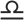

# Lunizodiacal

A lunar-tropical calendar web app: https://jakeoil.github.io/lunizodiacal

Displays days as a grid of parallelograms colored by zodiac sign, arranged in rows by lunar phase quarter.

## What it shows

Each day is a parallelogram cell colored by the Sun's tropical zodiac sign (12 colors, Aries through Pisces). Days in the same lunar phase quarter (new / first quarter / full / last quarter) flow right across a row; when the phase changes, the row drops down and resets left. Each row is roughly one week long and the grid covers one astronomical season (~91 days).

Visual markers:
- **Color**: tropical zodiac sign of the Sun (12 hues)
- **Split cells**: days where the Sun crosses a zodiac sign boundary are divided into two colored halves at the moment of transition
- **Date numbers**: EB Garamond old-style numerals rendered via Path2D outlines for cross-browser consistency
- **Month labels**: first of the month shows a bold small-cap abbreviation (e.g. "jan", "feb") using true small-cap glyphs from EB Garamond Bold
- **Zodiac symbols**: on sign-change days, the date number is replaced by the zodiac sign symbol (from Noto Sans Symbols)
- **Moon symbols**: Noto Emoji moon phase SVGs positioned tangent to the diagonal cell edge at phase start/end days
- **Red text**: Sundays
- **Thick top line**: week containing a new moon
- **Phase ticks**: small marks at lunar phase boundaries

## Legend

### Zodiac signs

<table>
  <tr><th>Season</th><th></th><th>Sign</th></tr>
  <tr bgcolor="#99FFCC"><td><b>Spring</b></td><td></td><td>Aries</td></tr>
  <tr bgcolor="#99FF99"><td></td><td></td><td>Taurus</td></tr>
  <tr bgcolor="#CCFF99"><td></td><td></td><td>Gemini</td></tr>
  <tr bgcolor="#FFFF99"><td><b>Summer</b></td><td></td><td>Cancer</td></tr>
  <tr bgcolor="#FFCC99"><td></td><td></td><td>Leo</td></tr>
  <tr bgcolor="#FF9999"><td></td><td></td><td>Virgo</td></tr>
  <tr bgcolor="#FF99CC"><td><b>Autumn</b></td><td></td><td>Libra</td></tr>
  <tr bgcolor="#FF99FF"><td></td><td></td><td>Scorpio</td></tr>
  <tr bgcolor="#CCCCFF"><td></td><td></td><td>Sagittarius</td></tr>
  <tr bgcolor="#99CCFF"><td><b>Winter</b></td><td></td><td>Capricorn</td></tr>
  <tr bgcolor="#66CCFF"><td></td><td></td><td>Aquarius</td></tr>
  <tr bgcolor="#66FFFF"><td></td><td></td><td>Pisces</td></tr>
</table>

### Moon phases

| | | | | |
|:-:|:--|:-:|:--|:-:|
| 🌑 | New Moon | — | Waxing Crescent | 🌒 |
| 🌓 | First Quarter | — | Waxing Gibbous | 🌔 |
| 🌕 | Full Moon | — | Waning Gibbous | 🌖 |
| 🌗 | Last Quarter | — | Waning Crescent | 🌘 |

## Usage

Open `index.html` via a local HTTP server (required for font and image loading) — no build step, no npm dependencies.

- **Pan**: drag (mouse or single-finger touch)
- **Zoom**: scroll wheel (desktop) or pinch (mobile)
- **Next season**: single click/tap on the canvas
- **Previous season**: double click/double tap on the canvas
- **Jump to date**: use the date picker overlay (reopened via the 📅 button)
- **Reload**: tap "Coylendar ↺" in the picker
- **Print**: tap Print in the picker — renders the current season at 150 dpi on letter-size paper with a white background
- **Year view**: select "Year (4 seasons)" in the picker to see all four seasons with dividers
- **Settings**: toggle split cells, phase ticks, moon symbols, and zodiac symbols in the picker

## Files

```
index.html          Full-screen canvas + date picker overlay
style.css           Styling and print media rules
astro.js            Astronomical math (sun angle, moon phase, zodiac sign)
calendarDate.js     Day cell data model and parallelogram rendering
app.js              Canvas orchestration, pan/zoom, season navigation, print
glyphs.js           Auto-generated Path2D outlines (digits, small caps, zodiac)
extract-glyphs.js   Node.js script to regenerate glyphs.js from font files
fonts/              EB Garamond OTF (Regular + Bold), Noto Sans Symbols TTF
emoji/              Noto Emoji moon phase SVGs (8 octants)
font-test.html      Font comparison tool (development)
glyph-test.html     Path2D glyph verification (development)
```

## Glyph rendering

Date numbers, month labels, and zodiac symbols are rendered as Path2D outlines extracted from font files, bypassing browser font rendering entirely. This guarantees pixel-identical positioning across Chrome, Firefox, and Safari.

- **Digits**: EB Garamond old-style figures (`zero.osf` through `nine.osf`) in regular weight
- **Month labels**: EB Garamond Bold true small-cap glyphs (`a.sc` through `y.sc`)
- **Zodiac signs**: Noto Sans Symbols U+2648–U+2653

To regenerate `glyphs.js` after modifying fonts: `npm install opentype.js && node extract-glyphs.js`

## Astronomical math

Ported from the CoylendarMax Android app. Key algorithms:

- **Sun position**: mean ecliptic longitude with elliptic correction (J2000 epoch)
- **Moon phase**: Julian Day → sun and moon ecliptic longitudes → phase angle
- **Zodiac sign**: sun longitude divided into 12 equal 30° sectors starting at Aries (vernal equinox)
- **Season**: sun longitude divided into 4 quadrants

All values are computed at the *end* of each calendar day (local midnight + 24 h) so the displayed sign/phase reflects what is true for most of that day. The algorithms are accurate for dates in the range ~1800–2200.

## Font licensing

- **EB Garamond** by Georg Duffner & Octavio Pardo — SIL Open Font License 1.1 ([source](https://github.com/octaviopardo/EBGaramond12))
- **Noto Sans Symbols** by Google — SIL Open Font License 1.1 ([source](https://github.com/googlefonts/noto-fonts))
- **Noto Emoji** by Google — Apache License 2.0 ([source](https://github.com/googlefonts/noto-emoji))

## Origin

Web port of the CoylendarMax Android app (Java/Canvas), which implements a lunisolar calendar showing the interplay of the tropical solar year and the synodic lunar cycle.
